# ERP Suite — Enterprise Resource Planning System

A full-stack, **multi-tenant ERP** built with the **MERN** stack (MongoDB, Express, React, Node.js).  
Organizations register their own company workspace, pick which modules to enable, and manage people, operations, finance, and communications from one place.

---

## Why this project

This is not a single-login toy dashboard. It models real SaaS-style ERP behavior:

- **Company registration** creates an Admin account and a configurable module set  
- **Join requests** let people request access; admins approve and assign roles  
- **JWT authentication** protects every API; **Socket.io** powers realtime chat  
- Domain data is **scoped per company** (tenancy)  
- Employees get self-service: attendance, leave, payroll slips, anonymous peer reviews  
- Admins control users, features, announcements, and company settings  

---

## Tech stack

| Layer | Technology |
|---|---|
| Frontend | React 18, Vite, React Router, Tailwind CSS v4, Recharts, Socket.io-client |
| Backend | Node.js, Express (MVC), Mongoose, JWT (`jsonwebtoken`), bcryptjs, Socket.io |
| Database | MongoDB Atlas / local MongoDB |
| Auth | Bearer JWT (7-day expiry), role-based access, inactivity logout on client |

---

## Architecture

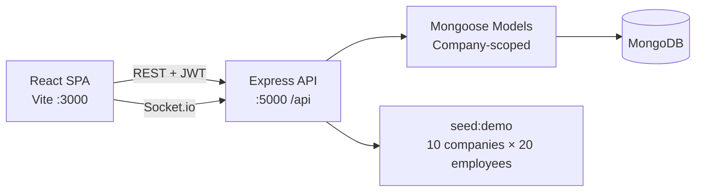

### High-level modules

| Module | Audience | Highlights |
|---|---|---|
| Dashboard | All | KPIs, attendance / expense / inventory charts |
| Employees & Departments | Admin / HR | Directory, roles, departments |
| Attendance | All | Mark presence; managers review |
| Leave | All + HR/Admin | Request & approve leave |
| Payroll | HR/Admin + self | Generate slips; employees view income |
| Inventory & Suppliers | Ops roles | Stock, thresholds, suppliers |
| Procurement | Staff + managers | Request / approve purchases |
| Finance | Finance roles | Revenue & expense ledger |
| Performance | Managers + self | Manager notes & ratings |
| Peer Reviews | All | **Anonymous** teammate ratings |
| Announcements | All + Admin/HR | Company news |
| Messages | All | REST + **realtime Socket.io** |
| Audit Logs | Admin | Action history |
| Company Settings / Users | Admin | Feature toggles, roles, activation |

---

## Screenshots

Live captures from the **NovaForge Labs** demo workspace. Image files are in [`assets/screenshots/`](./assets/screenshots/).

### Public pages

| Landing | Register |
|---|---|
| 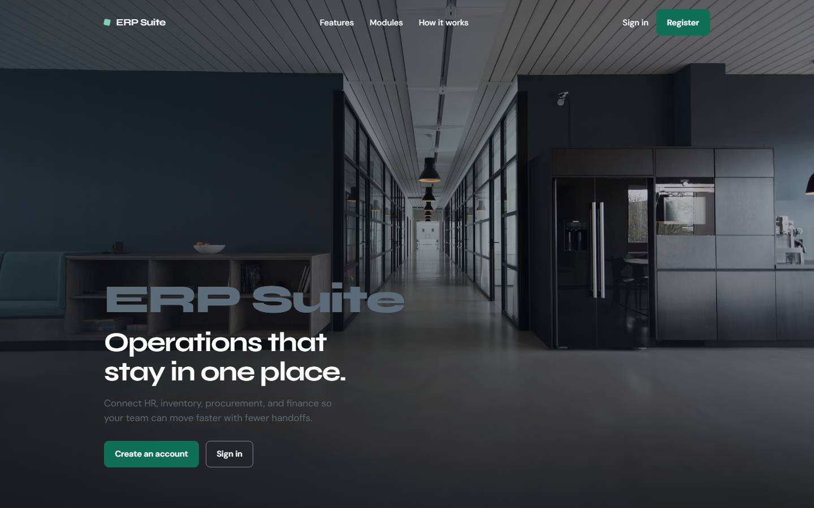 | 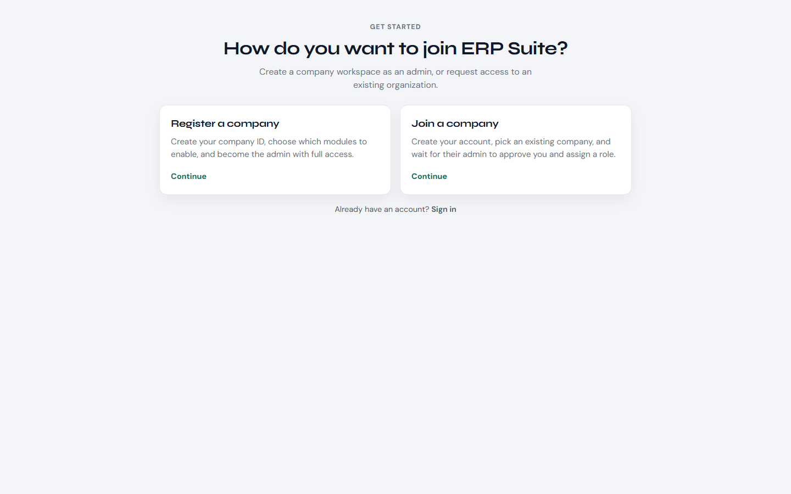 |

| Create company | Join company |
|---|---|
| 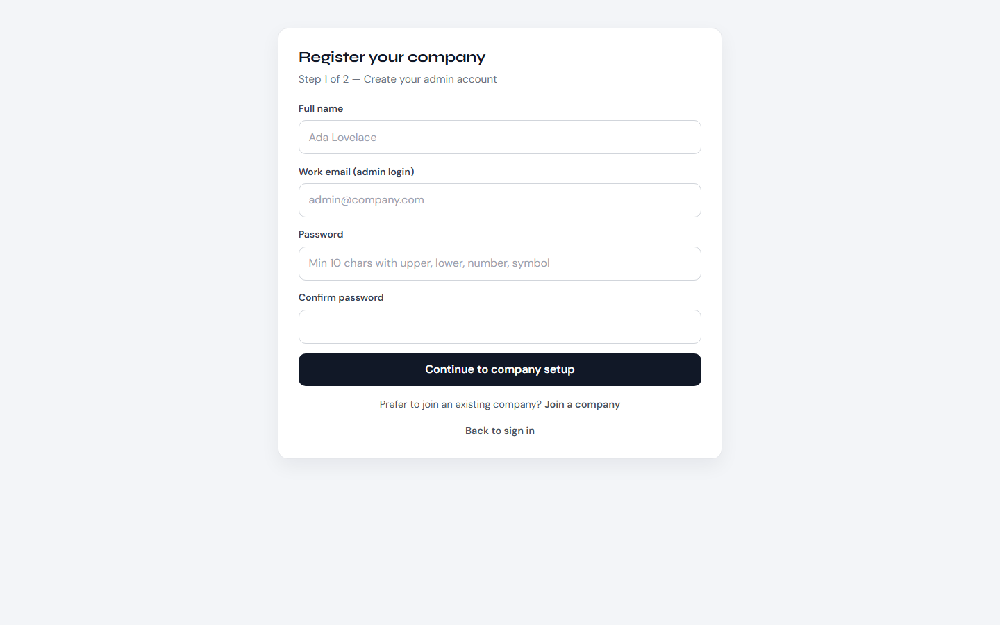 | 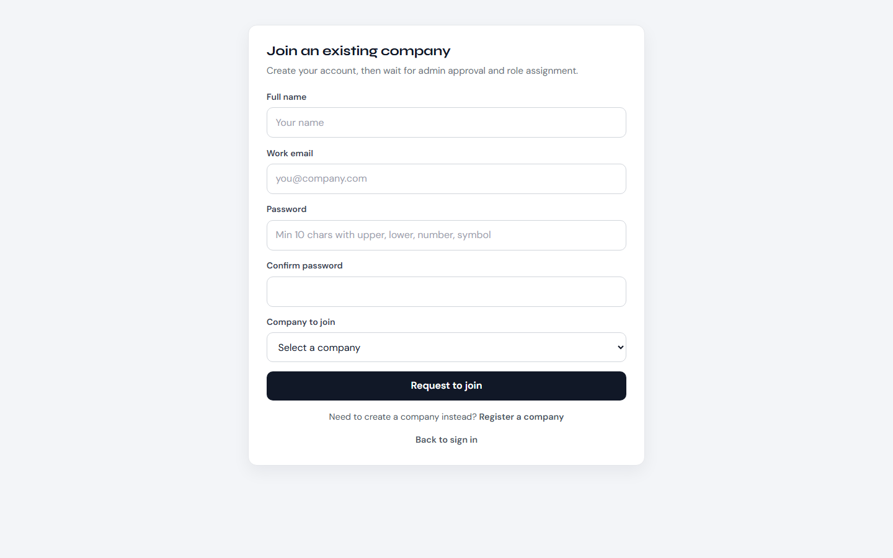 |

<p align="center">
  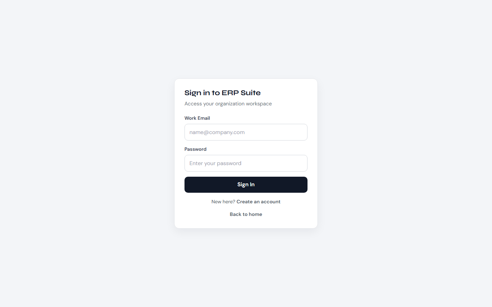
</p>

### App workspace

| Dashboard | Employees |
|---|---|
| 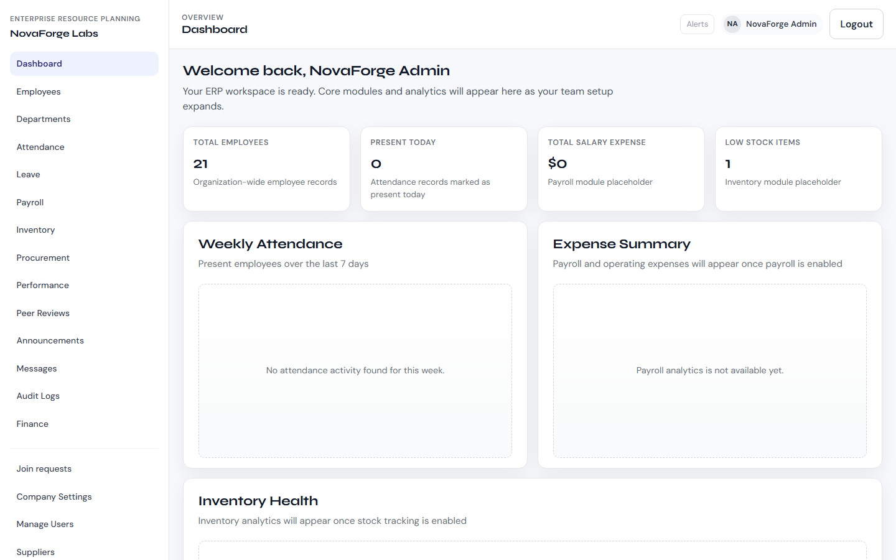 | 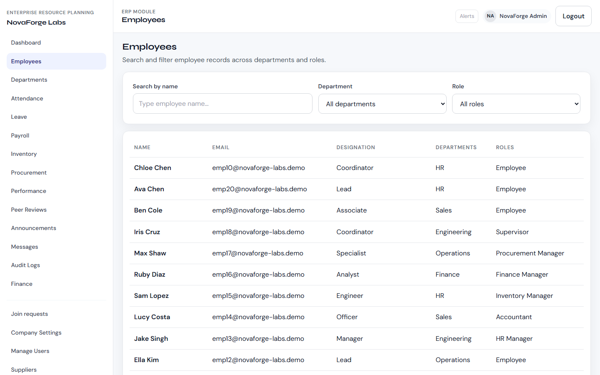 |

| Attendance | Leave |
|---|---|
| 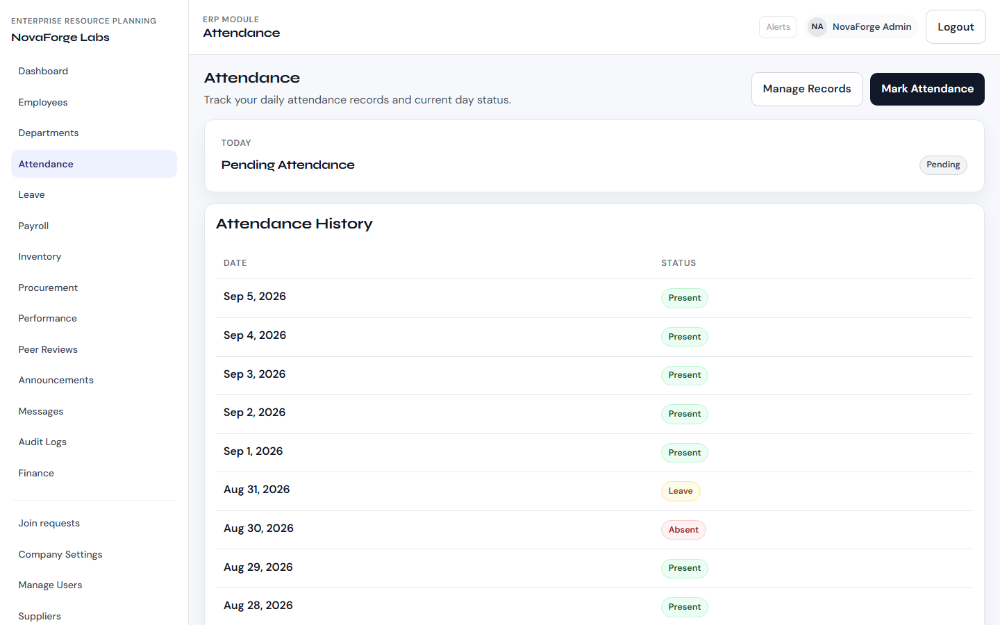 | 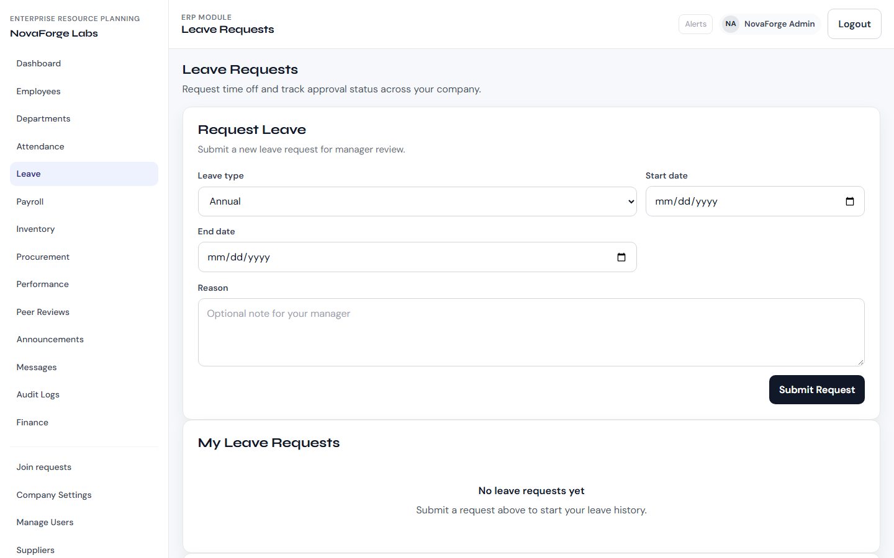 |

| Payroll | Inventory |
|---|---|
| 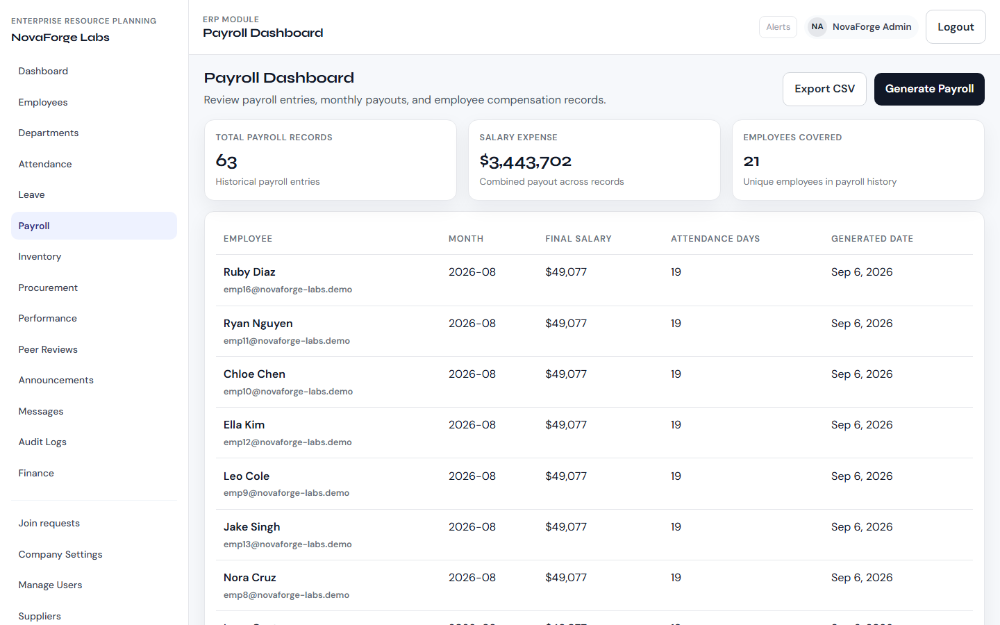 | 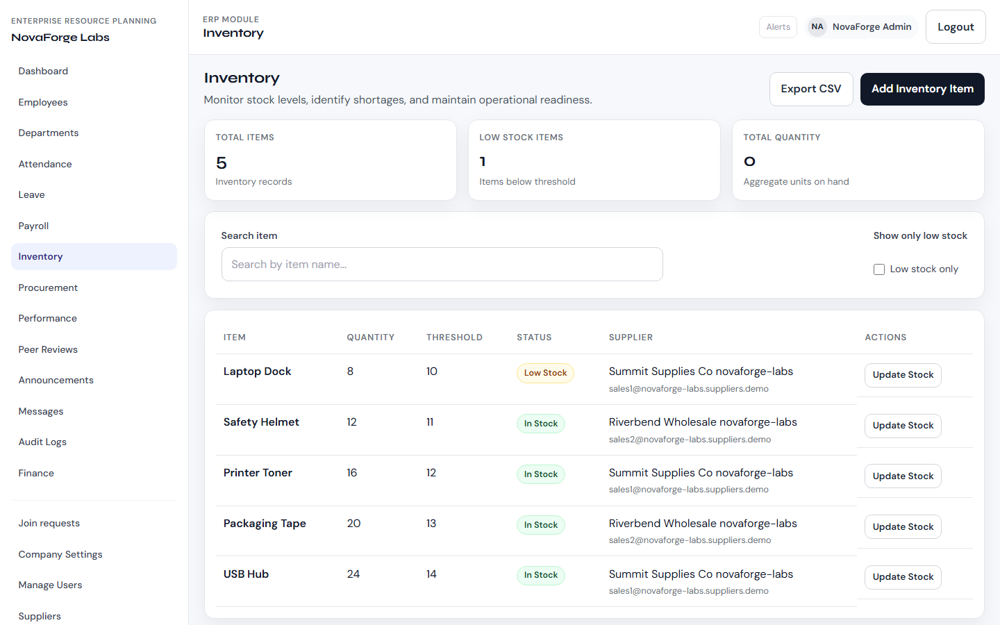 |

| Messages | Peer reviews |
|---|---|
| 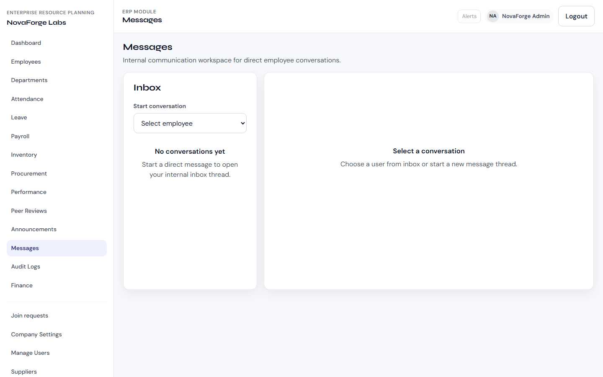 | 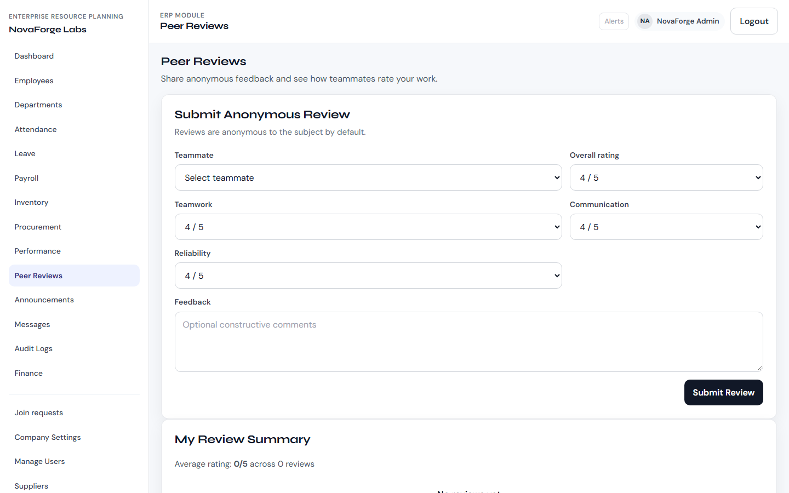 |

| Announcements | Company settings |
|---|---|
| 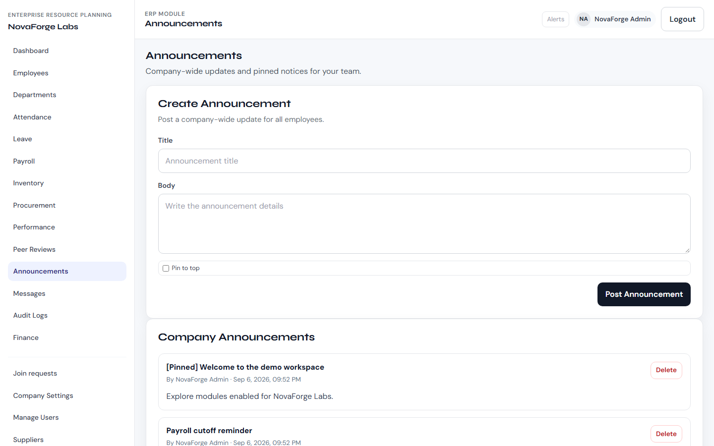 | 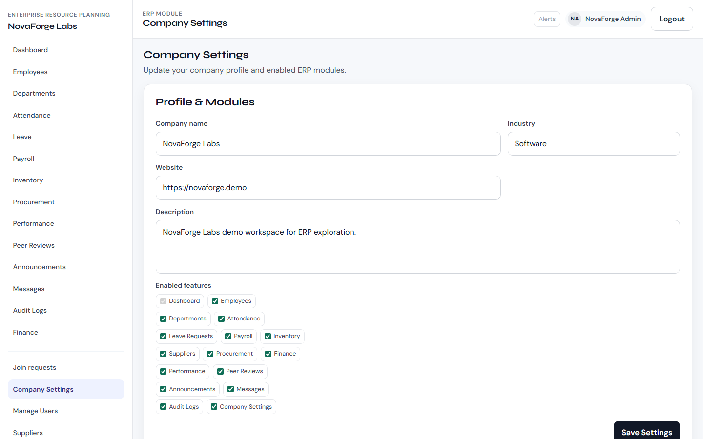 |

<p align="center">
  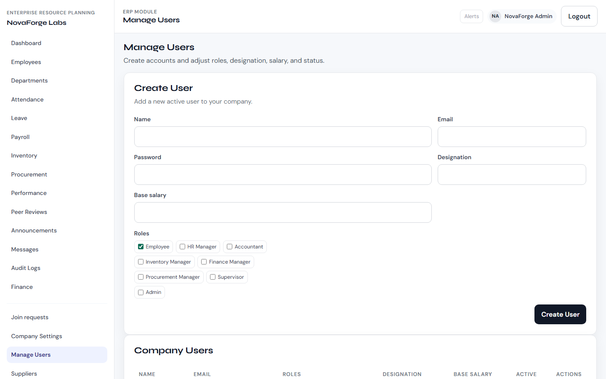
</p>

---

## Screens & flows (product tour)

1. **Landing** (`/`) — marketing hero, feature overview, register / sign-in CTAs  
2. **Register** (`/register`) — choose *Register a company* or *Join a company*  
3. **Company setup** — admin account + company profile + module picker  
4. **Join company** — pick existing org → pending until admin approval  
5. **Workspace** — sidebar filtered by company `enabledFeatures` + user roles  
6. **Admin** — Join requests, Manage users, Company settings  

---

## Getting started

### Prerequisites

- Node.js 18+  
- MongoDB Atlas URI **or** local MongoDB  

### Install

```bash
npm run install:all
```

### Environment

`backend/.env`:

```env
PORT=5000
NODE_ENV=development
MONGO_URI=your_mongodb_connection_string
JWT_SECRET=a_long_random_secret
MONGO_DB=erp
```

Optional `frontend/.env`:

```env
VITE_API_URL=http://localhost:5000/api
```

### Run

```bash
# both apps
npm run dev

# or separately
npm run dev:backend
npm run dev:frontend
```

- Frontend: http://localhost:3000  
- Backend: http://localhost:5000  
- Health: http://localhost:5000/api/health  

### Seed demo data (10 companies × ~20 employees each)

```bash
cd backend
npm run seed:demo
```

**Shared demo password:** `Demo@12345!`

| Company | Admin email |
|---|---|
| NovaForge Labs | `admin@novaforge-labs.demo` |
| Harborline Retail | `admin@harborline-retail.demo` |
| Cedar Peak Logistics | `admin@cedar-peak-logistics.demo` |
| Brightfield Health | `admin@brightfield-health.demo` |
| Silverline Manufacturing | `admin@silverline-manufacturing.demo` |
| OrbitPay Fintech | `admin@orbitpay-fintech.demo` |
| GreenSpan Energy | `admin@greenspan-energy.demo` |
| Atlas Civic Systems | `admin@atlas-civic-systems.demo` |
| LumenCraft Media | `admin@lumencraft-media.demo` |
| Northwind Foods | `admin@northwind-foods.demo` |

Employees: `emp1@{slug}.demo` … `emp20@{slug}.demo` (same password).

Seed volume is intentionally moderate so a **512 MB Atlas free/shared cluster** stays comfortable.

---

## Authentication & security

- Passwords hashed with **bcrypt** (strength rules enforced on the User model)  
- **JWT** signed with `JWT_SECRET`, payload includes `userId`, `roles`, `companyId`  
- `protect` middleware verifies token and loads user + company features  
- `authorizeRoles` enforces Admin / HR / Finance / etc.  
- Pending join accounts **cannot** log in until approved  
- Frontend stores token, refreshes `/auth/me` on boot, auto-logout on inactivity  

---

## Multi-tenancy

Every core domain document carries a `company` ObjectId. Controllers filter with `companyFilter(req.user)` and stamp `company` on create. Users from Company A cannot see Company B’s payroll, inventory, messages, or audits.

---

## Realtime messaging

- REST: create / inbox / conversation history  
- Socket.io: `message:send`, `message:new`, `message:read`  
- Authenticated with the same JWT used for REST  

---

## Project structure

```
├── backend/
│   ├── server.js              # HTTP + Socket.io + DB retry
│   ├── app.js                 # Express routes
│   ├── config/db.js           # Mongo connect (+ DNS fix for mongodb+srv)
│   ├── controllers/           # MVC controllers
│   ├── models/                # Mongoose schemas
│   ├── routes/                # /api/* routers
│   ├── middleware/            # auth, errors
│   ├── socket/                # realtime messaging
│   ├── scripts/seedDemoData.js
│   └── utils/                 # JWT, roles, features, company scope
├── frontend/
│   ├── src/pages/             # route screens
│   ├── src/components/        # layout, UI, charts, auth guards
│   ├── src/services/          # API + socket clients
│   └── src/context/AuthContext.jsx
└── README.md
```

---

## API surface (summary)

| Area | Prefix |
|---|---|
| Auth / companies / features | `/api/auth` |
| Admin users & company settings | `/api/admin` |
| Departments, employees, attendance | `/api/departments`, `/api/employees`, `/api/attendance` |
| Leave, peer reviews, announcements | `/api/leave`, `/api/peer-reviews`, `/api/announcements` |
| Payroll, inventory, suppliers, procurement | `/api/payroll`, `/api/inventory`, `/api/suppliers`, `/api/procurement` |
| Finance, performance, messages, audit | `/api/finance`, `/api/performance`, `/api/messages`, `/api/audit` |
| Dashboard & CSV export | `/api/dashboard`, `/api/export` |

---

## What recruiters should notice

- End-to-end product thinking (landing → onboarding → RBAC workspace)  
- Multi-tenant data modeling, not just UI tabs  
- JWT + Socket.io together  
- Seedable demo dataset for walkthroughs  
- Separated MVC backend and componentized React frontend  

---

## License

ISC — educational / portfolio project.
